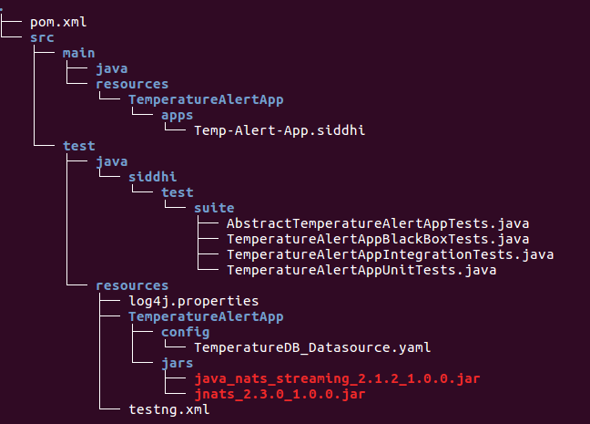

Siddhi TEST SUITE
======================================
Based on Siddhi Test Framework.
Siddhi Test Framework enable the CI/CD by dynamically spawning depended containers or integrating with external 
systems to test the integration flow.

## Dependencies 
* Oracle JDK 8, OpenJDK 8, or JDK 11 
* Maven 3.5.x or later version
* Docker
* Testcontainers. See [General Docker requirements](https://medium.com/r/?url=https%3A%2F%2Fwww.testcontainers.org%2Fsupported_docker_environment%2F).

### Directory layout
 

